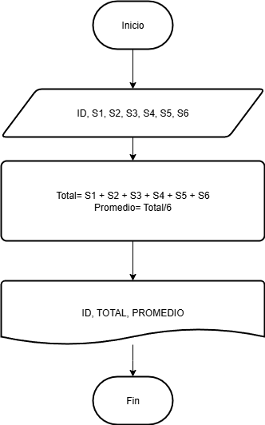
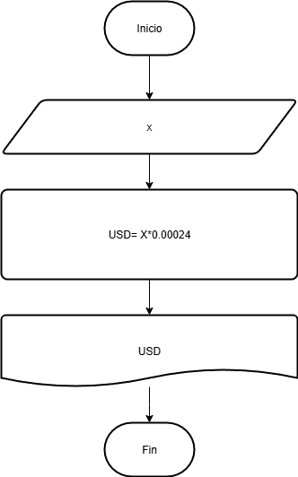

# Ejercicio 1
Construye un algoritmo que, al recibir como datos el ID del empleado y los seis primeros sueldos del año, calcule el ingreso total semestral y el promedio mensual, e imprima el ID del empleado, el ingreso total y el promedio mensual.

## pseudocodigo 

```
inicio
Leer ID, S1, S2, S3, S4, S5, S6
Total= S1 + S2 + S3 + S4 + S5 + S6
Promedio= Total/6
Mostrar ID, Total, Promedio
Fin
```



---

# Ejercicio 2

Una empresa inportadora desea determinar cuantos dolares puede adquirir con equis cantidad de dinero colombiano. Realice un driagrama de flujo y pseudocodigo que representen el algoritmo para tal fin 

## Pseudocodigo

```
Inicio 
Leer x
USD= x*0.00024
Mostrar USD
Fin 
```



---

# Ejercicio 3

Investiga cuáles son los símbolos que se utilizan para representar cada operación de un algorimo con un diagrama de flujo. Asegúrate de que la fuente es confiable, discute lo que encontraste con tus compañeros y con el profe. Cuando estés seguro/a de tener los símbolos correctos, consigna la información en la bitácora.

## Solucion 

### Símbolos principales

* **Inicio/Fin (óvalo o píldora):** Este símbolo marca el comienzo y el final de un algoritmo. Por lo general, contiene las palabras "Inicio" y "Fin", o "Comienzo" y "Terminar". Solo debe haber un inicio y un fin en el diagrama.

* **Proceso (rectángulo):** Representa una operación o un conjunto de acciones que el algoritmo debe realizar. Dentro del rectángulo se describe la tarea, por ejemplo: "Calcular el área del círculo" o "Asignar un valor a una variable". Es el símbolo más utilizado en un diagrama de flujo.

* **Decisión (rombo):** Indica un punto en el que se debe tomar una decisión. Dentro del rombo, se plantea una pregunta que tiene dos posibles respuestas, típicamente "Sí/No" o "Verdadero/Falso". Del rombo salen dos o más líneas de flujo, cada una con una etiqueta que indica la opción elegida, llevando a diferentes caminos en el algoritmo.

* **Entrada/Salida (paralelogramo):** Se usa para representar la información que entra o sale del algoritmo. Esto puede ser la entrada de datos por parte del usuario (como un valor ingresado por teclado) o la salida de resultados (como la impresión de un mensaje en la pantalla o en un documento).

* **Línea de flujo (flecha):** Conecta todos los símbolos del diagrama para indicar la secuencia en la que se ejecutan las operaciones. Las flechas muestran la dirección del flujo de la información o del control del programa. Generalmente, el flujo va de arriba hacia abajo y de izquierda a derecha.

---

### Símbolos adicionales

* **Conector (círculo):** Este símbolo se utiliza para conectar diferentes partes del diagrama de flujo que se encuentran en la misma página, especialmente si las líneas de flujo se vuelven complejas y se cruzan, para mantener la claridad. Dentro del círculo se coloca una letra o un número que se repite en otro conector en la parte del diagrama donde continúa el flujo.

* **Conector de página (pentágono):** Similar al conector de página, pero se usa para indicar que el flujo continúa en otra página.


---
# Ejercicio 4

* Realiza un algoritmo para determinar cuánto se debe pagar por cierta cantidad de lápices. Si la cantidad es de 1000 o más, el costo unitario es de $85.00. Si es menor, el costo unitario es de $90.00.

## Respuesta

### Pseudocodigo 

```
Inicio
  // Declarar variables
  Definir cantidad_lapices como Entero
  Definir precio_unitario, costo_total como Real

  // Pedir y leer la cantidad de lápices
  Escribir "Ingrese la cantidad de lápices:"
  Leer cantidad_lapices

  // Evaluar la cantidad para determinar el precio unitario
  Si cantidad_lapices >= 1000 Entonces
    precio_unitario = 85.00
  Sino
    precio_unitario = 90.00
  FinSi

  // Calcular el costo total
  costo_total = cantidad_lapices * precio_unitario

  // Mostrar el resultado
  Escribir "El costo total a pagar es: $", costo_total

Fin
```
--- 
### Diagrama de flujo

---
# Ejercicio 5

* Un almacén de ropa tiene una promoción: por compras superiores a $250 000 se les aplicará un descuento de 15%, de caso contrario, sólo se aplicará un 8% de descuento. Realice un algoritmo para determinar el precio final que debe pagar una persona por comprar en dicho almacén y de cuánto es el descuento que obtendrá. Represéntelo mediante el pseudocódigo y el diagrama de flujo.

## Respuesta

### Pseudocodigo

```
Inicio
  // Declarar variables
  Definir total_compra, descuento_porcentaje, monto_descuento, precio_final como Real

  // Pedir y leer el total de la compra
  Escribir "Ingrese el valor total de la compra:"
  Leer total_compra

  // Evaluar el total de la compra para aplicar el descuento
  Si total_compra > 250000 Entonces
    descuento_porcentaje = 0.15
  Sino
    descuento_porcentaje = 0.08
  FinSi

  // Calcular el monto del descuento y el precio final
  monto_descuento = total_compra * descuento_porcentaje
  precio_final = total_compra - monto_descuento

  // Mostrar los resultados
  Escribir "El monto del descuento es: $", monto_descuento
  Escribir "El precio final a pagar es: $", precio_final

Fin
```
### Diagrama de flujo 
.png>)
---
# Ejercicio 6

* El director de una escuela está organizando un viaje de estudios, y requiere determinar cuánto debe cobrar a cada alumno y cuánto debe pagar a la compañía de viajes por el servicio. La forma de cobrar es la siguiente: si son 100 alumnos o más, el costo por cada alumno es de $65.00; de 50 a 99 alumnos, el costo es de $70.00, de 30 a 49, de $95.00, y si son menos de 30, el costo de la renta del autobús es de $4000.00, sin importar el número de alumnos.

## Respuesta

### Pseudocodigo

```
Inicio
  // Declarar variables
  Definir num_alumnos, costo_unitario, costo_total_viaje como Real

  // Pedir y leer el número de alumnos
  Escribir "Ingrese el número de alumnos:"
  Leer num_alumnos

  // Evaluar el número de alumnos para determinar los costos
  Si num_alumnos >= 100 Entonces
    costo_unitario = 65.00
    costo_total_viaje = num_alumnos * costo_unitario
  Sino Si num_alumnos >= 50 Entonces // Implica que es < 100
    costo_unitario = 70.00
    costo_total_viaje = num_alumnos * costo_unitario
  Sino Si num_alumnos >= 30 Entonces // Implica que es < 50
    costo_unitario = 95.00
    costo_total_viaje = num_alumnos * costo_unitario
  Sino // Implica que es < 30
    costo_total_viaje = 4000.00
    costo_unitario = costo_total_viaje / num_alumnos
  FinSi

  // Mostrar los resultados
  Escribir "El costo total a pagar a la compañía de viajes es: $", costo_total_viaje
  Escribir "El costo por alumno es: $", costo_unitario

Fin
```
--- 
### Diagrama de flujo
.png>)

---
## Tarea 
Elabore un algoritmo que solicite al usuario su fecha de nacimiento (día, mes y año) y la fecha actual (día, mes y año). El algoritmo deberá calcular y mostrar la edad actual del usuario en años completos, considerando si ya ha cumplido años en el año en curso o no.

### pseudocodigo

```
inicio 
leer BD, BM, BY, dia, mes, año
Edad = año - BY

  Si mes >= BM Entonces 
    EdadF = Edad
  Sino mes < BM Entonces 
    EdadF = Edad - 1
  FinSi

Leer EdadF
Fin
```


--- 
## Bucles o ciclos 


### Ejercicios del libro

4.1) Un profesor tiene un salario inicial de $1500, y recibe un incremento de 10 % anual durante 6 años. ¿Cuál es su salario al cabo de 6
años? ¿Qué salario ha recibido en cada uno de los 6 años? Realice el
algoritmo y represente la solución mediante el diagrama de flujo, el
pseudocódigo y el diagrama N/S, utilizando el ciclo apropiado.`

### Pseudocodigo

```
Inicio
AÑO=1 
SAL=1500 
TOTAL=0  
Mientras AÑO < 7:
    ANUAL = SAL * 1.1
    TOTAL = TOTAL + ANUAL
    SAL = ANUAL
    AÑO = AÑO + 1
    MOSTRAR ANUAL 
Fin Mientras    
Mostrar TOTAL
Fin
```
--- 
### Diagrama de flujo 
.png>)

4.3) Se requiere un algoritmo para determinar, de N cantidades, cuántas son cero, cuántas son menores a cero, y cuántas son mayores a cero.

Realice el diagrama de flujo, el pseudocódigo y el diagrama N/S para
representarlo, utilizando el ciclo apropiado.

### Diagrama de flujo 
.png>)